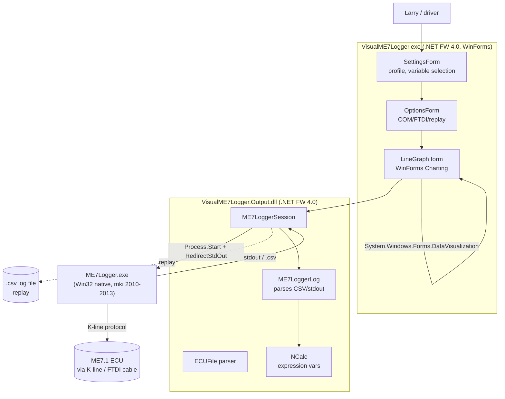
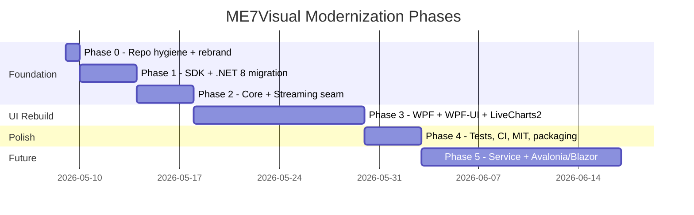
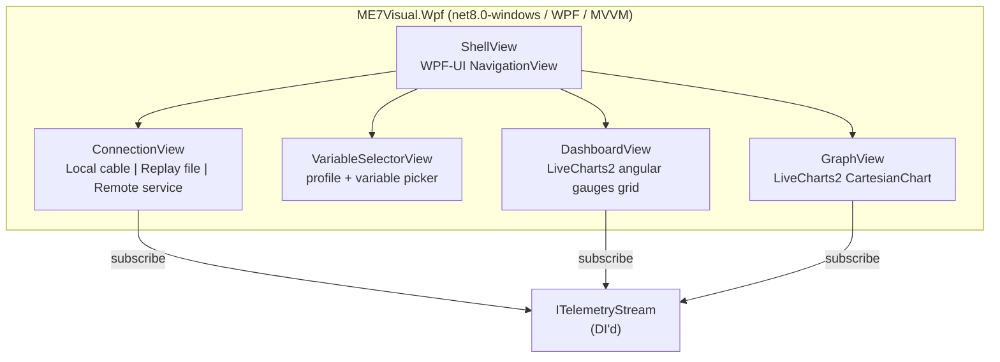

# ME7Visual — Modernization Roadmap

**Project:** ME7Visual (formerly VisualME7Logger-Plus)
**License:** MIT
**Author:** Drafted for Larry, May 2026
**Repo location:** `C:\Users\larry\Claude_Projects\VisualME7Logger\VisualME7Logger-Plus`
**Goal:** Rebuild as a modern .NET 8 WPF app with a clean streaming-service architecture so future cross-platform / carputer / web clients can be added without rewriting the UI.

---

## 1. Executive Summary

ME7Visual is the modernized successor to VisualME7Logger-Plus, a ~12-year-old C# WinForms application (Visual Studio 2013, .NET Framework 4.0) that wraps the third-party native `ME7Logger.exe` console tool to provide a graphical front-end for logging Motronic ME7.1 ECU data on Audi/VW vehicles. The core architecture is sound — a clean separation between a data-parsing library (`VisualME7Logger.Output`) and a UI project (`VisualME7Logger`) — but every layer of tooling, framework, and dependency around it is now obsolete.

**Confirmed direction: a B+C hybrid.** Migrate to .NET 8, refactor the data layer into a shared `Core` library that exposes telemetry through a clean streaming abstraction, build a WPF/WPF-UI/LiveCharts2 desktop app on top of it, and design the seam between Core and UI so a future SignalR service + Avalonia/Blazor client can be added without touching the UI viewmodels. The original `PolyMonControls.dll` gauge promise — shipped but never wired up — is finally delivered, this time with `LiveCharts2` angular gauges. Estimated effort: **3.5-4.5 weeks of part-time work to v1.0** (WPF desktop), with carputer/web phases unlocked cheaply afterwards.

---

## 2. Current State Audit

### 2.1 Solution Structure

```
VisualME7Logger-Plus/
├── VisualME7Logger.sln              ← VS2013 format, TFS/CodePlex bindings (defunct)
├── VisualME7Logger/                 ← WinForms UI app (.exe)
│   ├── Program.cs                   ← Entry point → SettingsForm
│   ├── SettingsForm.{cs,Designer}   ← Main config screen, profiles, expressions
│   ├── OptionsForm.{cs,Designer}    ← Connection options (COM/FTDI/log file)
│   ├── LineGraph.{cs,Designer}      ← THE visualization (System.Windows.Forms.DataVisualization)
│   ├── ChecksumForm, GraphVariableForm
│   └── resources/controls/
│       └── PolyMonControls.dll      ← Shipped but NEVER actually referenced
├── VisualME7Logger.Output/          ← Parsing library (.dll)
│   ├── LoggerSession.cs             ← Spawns ME7Logger.exe, parses stdout
│   ├── Log.cs, ECUFile.cs, EEPROM.cs
│   ├── CommunicationInfo.cs, IdentificationInfo.cs, ChecksumInfo.cs
│   └── resources/
│       ├── NCalc.dll                ← Expression evaluator (v1.3.8, file-referenced)
│       ├── Antlr3.Runtime.dll       ← NCalc dependency
│       └── ME7Logger/               ← The native binaries + sample logs/configs
│           ├── bin/ME7Logger.exe    ← Win32 native, ©mki 2010-2013
│           ├── bin/ME7Info.exe
│           ├── lib/libME7Logger.dll, libME7Logger.a
│           ├── ecus/*.ecu           ← Sample ECU characteristics
│           └── logs/*.csv, *.cfg    ← Sample log files (your test fixtures)
└── ME7Logger/                       ← Duplicate copy of the native logger
```

### 2.2 Architecture (current)



### 2.3 Three Session Modes (already a clean design)

The `ME7LoggerSession` class already supports three modes — this is a real strength:

| Mode | What it does | Why it matters for modernization |
|---|---|---|
| `RealTime` | Spawns `ME7Logger.exe`, parses live stdout | Needs ECU + cable |
| `LogFile` | Reads a saved `.csv` log directly | **Test against the included `allroad-config_20131016_213900.csv` fixture** |
| `SessionOutput` | Replays a captured stdout dump (for debug) | Useful for unit tests |

This means you can do most modernization work without ever connecting to a car.

### 2.4 Key External Dependencies

| Dependency | Where it lives | Status | Modernization plan |
|---|---|---|---|
| .NET Framework 4.0 | TargetFrameworkVersion in csproj | Out of mainstream support; MS only ships fixes for 4.6.2+ | Migrate to .NET 8 (LTS) |
| `System.Windows.Forms` | BCL reference | Available on .NET 6/7/8 (Windows-only) | Keep if Option A; replace with WPF if Option B |
| `System.Windows.Forms.DataVisualization` | BCL reference (the chart control) | **Removed from modern .NET BCL** | Use `LiveCharts2` or `WinForms.DataVisualization` community NuGet |
| `PresentationCore` / `PresentationFramework` | WPF references | Available on .NET 6/7/8 | Used today only via `WindowsFormsIntegration`; becomes primary in Option B |
| `NCalc 1.3.8` | `resources/NCalc.dll` (file ref, not NuGet) | Old; modern fork is `NCalc.Sync` or `NCalcAsync` on NuGet | Replace with `NCalcSync` NuGet package |
| `Antlr3.Runtime.dll` | `resources/Antlr3.Runtime.dll` | Pulled in transitively by NCalc | Disappears once NCalc is replaced |
| `PolyMonControls.dll` (Dashboarding) | `resources/controls/` | **Listed only as `<Content>` — never actually compiled in.** The README's gauge promise was never delivered | Drop entirely; replace with `LiveCharts2` gauges |
| ILMerge | Post-build event | Unmaintained since ~2017 | Use `dotnet publish --self-contained -p:PublishSingleFile=true` |
| TFS / CodePlex bindings | `Scc*` keys in .sln | CodePlex shut down in 2017 | Strip from .sln |
| `Encoding.UTF7` | `Log.cs`, `ECUFile.cs` | **Obsolete in .NET 5+ (warns, may throw)** | Switch to UTF-8 |

### 2.5 What's Surprisingly Healthy

- The native `ME7Logger.exe` is a stable, well-documented binary with a CSV+stdout contract. **You don't need to touch it.**
- The session/log/ECU-file parsers in `VisualME7Logger.Output` are plain BCL code — no WPF, no WinForms. They're already shaped like a portable library.
- `LoggerSession` already abstracts realtime vs replay vs file — perfect seam for testing without hardware.
- Sample fixture files (`allroad-config_20131016_213900.csv`, `example_log.cfg`, `*.ori.ecu`) are checked in, so you can validate every change without a car.

### 2.6 What Will Hurt If Ignored

- **`Encoding.UTF7`** in `Log.cs` line 34 (`new StreamReader(logFilePath, Encoding.UTF7)`). On modern .NET this is obsolete; on .NET 5+ it produces a warning and on .NET 6+ it's effectively a no-op without `AppContext` switches. Must be replaced.
- **Hardcoded admin check** in `SettingsForm.cs` (lines 52-63) — pops a "you should run as admin" warning. Modern app UX should handle COM-port permissions explicitly, not via global elevation.
- **No NuGet `packages.config` or `PackageReference`** — every dependency is a file in `resources/`. There's no version discipline.
- **No tests.** None. The sample log files in the repo are practically begging to be turned into golden-file test fixtures.
- **TFS source-control noise** in the `.sln` (`SccProjectName`, `SccLocalPath`, `https://tfs.codeplex.com/...`). Modern Git tooling and Visual Studio will keep complaining about this.

---

## 3. Architecture — B+C Hybrid (Confirmed Direction)

Rather than picking pure Option B (WPF only) or pure Option C (service-first rewrite), ME7Visual takes a hybrid path: **build the WPF app first, but design the seam between the data layer and the UI as a streaming abstraction from day one.** That single design decision is what unlocks future cross-platform and carputer work without ever rewriting the WPF code.

### 3.1 The Key Architectural Seam

The `ME7Visual.Core` library exposes telemetry through an `ITelemetryStream` abstraction. The UI viewmodels depend only on that abstraction. There are two implementations from day one:

1. **`InProcessTelemetryStream`** — direct calls to Core's `ME7LoggerSession`. Zero network. Used by WPF when running locally with the cable plugged into this machine.
2. **`SignalRTelemetryStream`** — connects to a remote `ME7Visual.Service` over WebSocket. Used by WPF when "Connect to remote" is selected, and by every future client (Avalonia, Blazor, PWA).

Same DTOs flow through both paths, so a viewmodel doesn't know or care which one is wired in.

### 3.2 Target Architecture

```mermaid
flowchart TB
    ECUHW[(ME7.1 ECU<br/>via K-line / FTDI cable)]
    Native["ME7Logger.exe<br/>native sidecar"]

    subgraph CoreLib["ME7Visual.Core (netstandard2.0)"]
        Sess[ME7LoggerSession<br/>spawn/parse/replay]
        Parsers[ECUFile / Log<br/>parsers]
        Sess --> Parsers
    end

    subgraph Streaming["ME7Visual.Streaming (netstandard2.0)"]
        ITS["ITelemetryStream<br/>+ TelemetrySample DTO"]
        InProc[InProcessTelemetryStream]
        SRClient[SignalRTelemetryStream<br/>client]
        InProc -. implements .-> ITS
        SRClient -. implements .-> ITS
    end

    subgraph Service["ME7Visual.Service (net8.0)"]
        Hub["TelemetryHub<br/>SignalR /hub"]
        SRHost[Hosts ME7Visual.Core]
        Hub --> SRHost
    end

    subgraph WPF["ME7Visual.Wpf (net8.0-windows)"]
        Shell[ShellView<br/>WPF-UI Fluent]
        Conn[ConnectionViewModel<br/>Local | Replay | Remote]
        Dash[DashboardView<br/>LiveCharts2 gauges]
        Graph[GraphView<br/>LiveCharts2 charts]
        Conn --> Dash & Graph
    end

    subgraph Future["Phase 5 — same plug, new clients"]
        Avalonia[Avalonia desktop<br/>Linux Pi carputer]
        Blazor[Blazor PWA<br/>phone/tablet]
    end

    ECUHW <--> Native <--> Sess
    InProc --> Sess
    SRClient -- WebSocket --> Hub
    SRHost --> Sess
    Conn -- DI'd --> ITS
    Avalonia -.uses.-> SRClient
    Blazor -.uses.-> Hub
```

### 3.3 What Each Project Does

| Project | TFM | Role |
|---|---|---|
| `ME7Visual.Core` | netstandard2.0 | All ECU/log parsing, session lifecycle, native process management. No UI, no networking. Direct successor to `VisualME7Logger.Output`. |
| `ME7Visual.Streaming` | netstandard2.0 | `ITelemetryStream` interface, `TelemetrySample` DTO, `SessionEvent` DTO, the in-process and SignalR-client implementations. |
| `ME7Visual.Service` | net8.0 | ASP.NET Minimal API + SignalR Hub. Hosts `Core` and broadcasts telemetry. Optional — only runs when you want a remote/headless data source. |
| `ME7Visual.Wpf` | net8.0-windows | The desktop app. WPF + MVVM + WPF-UI shell + LiveCharts2. Connects to `ITelemetryStream`. |
| `ME7Visual.Tests` | net8.0 | xUnit tests, golden-file fixtures from existing sample CSVs. |
| `ME7Visual.Web` (Phase 5) | net8.0 | Blazor WASM PWA. |
| `ME7Visual.Avalonia` (Phase 5) | net8.0 | Cross-platform desktop for Raspberry Pi 5 / 7" touchscreen. |

### 3.4 Why This Beats Pure B Or Pure C

- **vs. pure Option B:** for ~3-5 days of extra work in Phases 2-3 (defining the streaming seam), you get a pluggable architecture that survives future device targets. The WPF app still works fully without ever running the service — there's no daily-driver complexity tax.
- **vs. pure Option C:** you don't rebuild the UI twice. The WPF app is the canonical client, the Avalonia/Blazor clients are siblings. You're not learning two new UI frameworks on day one.
- **The `ITelemetryStream` is genuinely simple** — it's basically `IObservable<TelemetrySample> Samples { get; }` plus a couple of session-lifecycle events. Not a heavyweight CQRS bus.

### 3.5 Comparison vs. The Discarded Alternatives

| Criterion | Pure B | **B+C Hybrid (chosen)** | Pure C |
|---|---|---|---|
| Effort to v1.0 (WPF) | 3-4 wks | **3.5-4.5 wks** | 6-8 wks |
| Effort to add Pi/web later | 2-3 wks (refactor required) | **1-2 wks** (drop in client) | 0 (already there) |
| Day-1 deployment complexity | One .exe | **One .exe** | Service + client |
| Future-proof | 10 yrs | **10+ yrs** | 10+ yrs |
| Can run fully local? | Yes | **Yes** | Yes (with local service) |
| Risk | Moderate | **Moderate** | High |

---

## 4. Phased Plan (B+C Hybrid)



### Phase 0 — Repo Hygiene + Rebrand (½-1 day)

Goal: clean working tree under the new `ME7Visual` identity.

1. Create branch `legacy-vs2013` pinned to current `master` — frozen reference.
2. Create branch `modernize` — all work happens there.
3. Strip TFS/CodePlex bindings from `VisualME7Logger.sln` (`SccProjectName`, `SccLocalPath`, `SccTeamFoundationServer`).
4. Add a modern `.gitignore` (`.vs/`, `bin/`, `obj/`, `*.user`, `**/launchSettings.json`).
5. Add `LICENSE` file with MIT text (Copyright Larry, 2026).
6. Add this `MODERNIZATION_ROADMAP.md` at the repo root.
7. Begin the rebrand: rename solution to `ME7Visual.sln`, add a new top-level `src/` folder. Don't rename source assemblies yet — that happens in Phase 1 alongside the SDK conversion to avoid double-thrashing.
8. Push the `modernize` branch to GitHub and pin the roadmap as a public Project / Issue.

### Phase 1 — SDK-Style + .NET 8 Migration (1-2 days)

Goal: existing UI compiles and runs on .NET 8 under the new project names.

1. Convert both `.csproj` files to SDK-style and rename:
   - `VisualME7Logger.csproj` → `src/ME7Visual.Wpf/ME7Visual.Wpf.csproj` *(still WinForms-based at this point — WPF rebuild happens in Phase 3; this just gets us building on net8.0)*. Actually simpler: keep it as `ME7Visual.WinFormsLegacy` for the duration of Phase 1-2 so it can serve as a runnable reference while the new WPF UI is built. It gets deleted at end of Phase 3.
   - `VisualME7Logger.Output.csproj` → `src/ME7Visual.Core/ME7Visual.Core.csproj`
   ```xml
   <Project Sdk="Microsoft.NET.Sdk">
     <PropertyGroup>
       <TargetFramework>net8.0-windows</TargetFramework> <!-- legacy WinForms project -->
       <UseWindowsForms>true</UseWindowsForms>
       <Nullable>disable</Nullable>
       <LangVersion>latest</LangVersion>
     </PropertyGroup>
   </Project>
   ```
2. Replace `resources/NCalc.dll` + `Antlr3.Runtime.dll` file-references with `<PackageReference Include="NCalcSync" Version="..." />`.
3. Replace `Encoding.UTF7` with `Encoding.UTF8` in `Log.cs` and anywhere else it appears.
4. Replace `System.Windows.Forms.DataVisualization` with the community port `<PackageReference Include="WinForms.DataVisualization" Version="1.9.x" />` (legacy project only — the WPF rebuild won't need it).
5. Delete the ILMerge `<PostBuildEvent>` — modern publishing handles single-file output.
6. Update namespaces: `VisualME7Logger.*` → `ME7Visual.*`. A repo-wide find/replace handles 95%; verify with `dotnet build`.
7. Run `dotnet build`, fix breakages. Common ones:
   - `[Serializable]` + `BinaryFormatter` (removed in .NET 8) → `System.Text.Json`.
   - `WindowsIdentity.GetCurrent()` admin check — keep but make non-fatal (or delete: WPF-UI doesn't need elevation).
   - Any `WebClient` → `HttpClient`.
8. Run the legacy app via `dotnet run --project src/ME7Visual.WinFormsLegacy` and load `allroad-config_20131016_213900.csv` in replay mode. **Goal: parse-and-graph still works on .NET 8.**

### Phase 2 — Core + Streaming Seam (3-4 days) ⭐ *the hybrid-architecture phase*

Goal: data layer is portable, UI talks to it through `ITelemetryStream`.

1. Inside `ME7Visual.Core` (netstandard2.0):
   - Sweep all WinForms types out (`System.Windows.Forms.*`, `Application.DoEvents`, etc.).
   - Replace any UI-thread `Invoke` with `IProgress<T>` or plain events.
   - Introduce `IProcessRunner` abstraction so `Process.Start("ME7Logger.exe", ...)` can be mocked in tests.
2. Create `src/ME7Visual.Streaming/` (netstandard2.0):
   ```csharp
   public sealed record TelemetrySample(
       DateTime TimestampUtc,
       IReadOnlyDictionary<string, double> Values);

   public sealed record SessionEvent(
       SessionEventType Type,    // Opening, Initialized, Open, Closed, Error
       string? Message);

   public interface ITelemetryStream : IAsyncDisposable
   {
       IObservable<TelemetrySample> Samples { get; }
       IObservable<SessionEvent>    Events  { get; }
       Task StartAsync(SessionConfig cfg, CancellationToken ct);
       Task StopAsync(CancellationToken ct);
   }
   ```
3. Implement `InProcessTelemetryStream` in `ME7Visual.Streaming` — wraps `ME7Visual.Core.ME7LoggerSession` and exposes its events through the abstraction. Zero networking, zero overhead.
4. Stub `SignalRTelemetryStream` with the same shape but commented `TODO: Phase 5` body. **The point is the WPF app already references `ITelemetryStream` from day one** — flipping to a remote source later is a DI registration change, not a code change.
5. Stand up `tests/ME7Visual.Tests` (xUnit + FluentAssertions):
   - Golden-file test: feed `resources/ME7Logger/logs/allroad-config_20131016_213900.csv` through `InProcessTelemetryStream` (replay mode, no real `ME7Logger.exe`) and assert sample count, variable names, and a handful of values.
   - Parser tests for each `.cfg` and `.ecu` fixture in the repo.
   - **This is the regression net that protects every later phase.**

### Phase 3 — WPF UI (`ME7Visual.Wpf`) (1.5-2 weeks)

Goal: the new app. Modern, themed, with the gauge dashboard the original README always promised.



**Confirmed NuGet stack:**

- `CommunityToolkit.Mvvm` — source-generated `ObservableObject`, `[ObservableProperty]`, `[RelayCommand]`.
- `LiveChartsCore.SkiaSharpView.WPF` — line charts AND angular gauges. GPU-accelerated.
- `Wpf.Ui` (WPF-UI) — Fluent/Mica chrome, modern controls, dark/light theme.
- `Microsoft.Extensions.Hosting` — DI container, `IHostedService` for clean session lifecycle.
- `Microsoft.Extensions.Logging.Debug` + `Serilog.Sinks.File` — replace the ad-hoc `DEBUG.TXT` writer in `Program.cs`.

**Per-feature mapping from legacy → new:**

| Old (WinForms) | New (WPF / MVVM) |
|---|---|
| `SettingsForm` (profiles, expressions) | `ShellView` left nav: Connection / Variables / Dashboard / Graph |
| `OptionsForm` (COM/FTDI/replay) | `ConnectionView` — radio group bound to `ConnectionViewModel.Mode`. New 3rd option: "Remote service (URL)" — disabled until Phase 5 |
| `LineGraph.cs` + DataVisualization Chart | `GraphView` with `<lvc:CartesianChart>` |
| Never-shipped PolyMon gauges | **`DashboardView`** — `lvc:PieChart` angular gauges in a configurable `UniformGrid`, one per logged variable, drag-to-arrange |
| `GraphVariableForm` | Inline series styling in `GraphView` |
| XML profile file | `System.Text.Json` profile (`%AppData%/ME7Visual/profiles/*.json`) |
| `WindowsIdentity` admin warning | Removed |

**UX wins:** dark-mode-friendly Mica window, smooth 60fps charts on thousands of points, animated gauges, touch-friendly sizing ready for in-car tablet, no admin elevation, no UTF7-corrupted text.

### Phase 4 — Tests, CI, Packaging, Public Roadmap (3-4 days)

1. Expand `ME7Visual.Tests`: golden-file coverage for every `.csv` / `.cfg` / `.ecu` in `resources/ME7Logger/`.
2. GitHub Actions:
   - **CI workflow:** on push/PR run `dotnet build` + `dotnet test` on `windows-latest`.
   - **Release workflow:** on `v*` tag run `dotnet publish src/ME7Visual.Wpf -c Release -r win-x64 --self-contained -p:PublishSingleFile=true -p:IncludeNativeLibrariesForSelfExtract=true` and attach the `.exe` to a GitHub Release.
3. Rewrite `README.md`: project banner/screenshot, supported ECUs (with the existing Audi A6 allroad 2.7T BEL fixture as proof-of-life), quick-start, build instructions, contribution guide, credit to the original `mki` ME7Logger and the original VisualME7Logger author.
4. **Public roadmap:** convert each Phase 5 line-item into a GitHub Issue, group under a "v2.0 — Carputer" Project board. Pin this `MODERNIZATION_ROADMAP.md` from the README.
5. Audit `ME7Logger/doc/LICENSE.txt` for redistribution rules; document them in `THIRD_PARTY_NOTICES.md`.
6. Delete `ME7Visual.WinFormsLegacy` — it served its purpose.

### Phase 5 — Service + Cross-Platform Clients (Optional, 2-3 weeks)

The hybrid architecture pays off here. Each item is a **drop-in addition** that doesn't touch any code from Phases 0-4.

1. **`ME7Visual.Service`** (net8.0): ASP.NET Minimal API + SignalR Hub. Wraps `ME7Visual.Core` and broadcasts samples. Designed to be hostable as a Windows service or a Linux systemd unit (for a Raspberry Pi running the Linux ME7Logger build mentioned in `ME7Logger/doc/README.txt`).
2. **`SignalRTelemetryStream`** body filled in (it was stubbed in Phase 2). Now `ME7Visual.Wpf` can pick "Remote service" in `ConnectionView` — without any other change.
3. **`ME7Visual.Avalonia`**: Avalonia 11 app reusing 80-90% of the WPF XAML. Targets Windows + Linux ARM (Pi 5 + 7" touchscreen carputer). Talks to the Service over SignalR.
4. **`ME7Visual.Web`**: Blazor WASM PWA. Phone-on-the-dash use case. Same SignalR client.
5. **Telemetry export:** session-to-JSON with embedded ECU metadata.
6. **Profile sharing:** community-shareable JSON profiles ("Stage 2 starter pack", "knock-tuning preset").

---

## 5. Risk Register

| # | Risk | Likelihood | Impact | Mitigation |
|---|---|---|---|---|
| R1 | `WinForms.DataVisualization` community port has rough edges | Medium | Low | Plan to swap to LiveCharts2 in Phase 3 anyway; treat Phase 1's port as throwaway |
| R2 | Hidden behavioral dependency on .NET FW 4.0 quirk (Encoding.UTF7, BinaryFormatter, etc.) | Medium | Medium | Phase 2 golden-file tests catch regressions; spot-check by replaying real `.csv` logs and comparing parsed values |
| R3 | `ME7Logger.exe` stdout format changes between versions | Low | High | The native binary is frozen at v1.20 (2013) — pin its hash in CI; document expected format in `Core` |
| R4 | No real ECU access to validate live-mode regressions | High (you said access is limited) | Medium | Build a `SessionType.Replay` mock that streams a saved `.csv` line-by-line at original timestamps; covers ~95% of the live-mode code path |
| R5 | Original PolyMon gauge code never shipped — no working reference for the dashboard layout | Certain | Low | Treat the dashboard as a fresh design; LiveCharts2 sample gallery + WPF-UI examples are good starting points |
| R6 | License ambiguity (project has no LICENSE file) | Medium | Medium | Phase 4 step: pick a license, audit the `ME7Logger` LICENSE.txt for redistribution rules before bundling its binaries |
| R7 | Target framework choice (`net8.0-windows` vs `net9.0`) | Low | Low | Pin to `net8.0` (LTS through Nov 2026 + 1 yr extended) — upgrade later is one line |

---

## 6. Effort Estimate Summary

| Phase | Calendar (part-time) | Engineering hrs | Confidence |
|---|---|---|---|
| 0 — Repo hygiene + rebrand | ½-1 day | 4-6 | High |
| 1 — SDK + .NET 8 | 1-2 days | 8-14 | High |
| 2 — Core + Streaming seam | 3-4 days | 16-24 | Medium-high |
| 3 — WPF UI rebuild | 1.5-2 weeks | 40-60 | Medium |
| 4 — Tests, CI, MIT, packaging, public roadmap | 3-4 days | 16-24 | High |
| **Total to v1.0** | **3.5-4.5 weeks** | **84-128 hrs** | **Medium-high** |
| 5 — Service + Avalonia + Blazor | +2-3 weeks | 60-100 | Medium (scope-dependent, but architecture already supports it) |

The B+C hybrid adds ~1-1.5 days of Phase 2 work (the streaming abstraction) compared to a pure Option B plan. That cost buys roughly **2 weeks of saved Phase 5 work** — the WPF viewmodels never need refactoring when remote/web/carputer clients show up.

---

## 7. Confirmed Decisions

| # | Decision | Choice |
|---|---|---|
| 1 | License | **MIT** (`Copyright (c) 2026 Larry`) |
| 2 | WPF look-and-feel | **WPF-UI** (`Wpf.Ui` NuGet) — Fluent/Mica chrome |
| 3 | Chart + gauge library | **LiveCharts2** (`LiveChartsCore.SkiaSharpView.WPF`) — covers both |
| 4 | Project name | **ME7Visual** (clean break from `VisualME7Logger-Plus`) |
| 5 | Public roadmap | **Yes** — pin this doc + Phase-5 GitHub Issues + Project board |
| 6 | Architecture | **B+C Hybrid** — WPF v1.0 with `ITelemetryStream` seam baked in for future Service/Avalonia/Blazor clients |

---

## 8. Immediate Next Steps

Phase 0 is greenlit. Concrete first commits:

1. **Branching:** create `legacy-vs2013` (frozen ref) and `modernize` (work branch).
2. **Solution housekeeping:** rename `VisualME7Logger.sln` → `ME7Visual.sln`, strip CodePlex/TFS bindings, add modern `.gitignore`, add `LICENSE` (MIT).
3. **Repo layout:** introduce top-level `src/` and `tests/` folders. Move source into `src/ME7Visual.WinFormsLegacy/` (the existing UI, soon-to-be-replaced) and `src/ME7Visual.Core/` (the Output project).
4. **Roadmap publication:** commit this file at the repo root, push the branch to GitHub, open a pinned Issue / GitHub Project board titled "ME7Visual v1.0 (B+C hybrid)" with each Phase 0-5 step as a checklist.
5. **Smoke test:** verify the legacy WinForms project still loads `allroad-config_20131016_213900.csv` after the file moves — that's the parsing-still-works baseline.

Once Phase 0 is in, Phase 1 is a focused 1-2 day sprint: SDK-style csproj conversion, `Encoding.UTF7` → `UTF8`, swap NCalc + WinForms.DataVisualization NuGets, `dotnet build`, fix breakages, `dotnet run` — and the legacy app is alive on .NET 8.

Each phase ends with a working, runnable app — you're never weeks-deep without something to click on.
